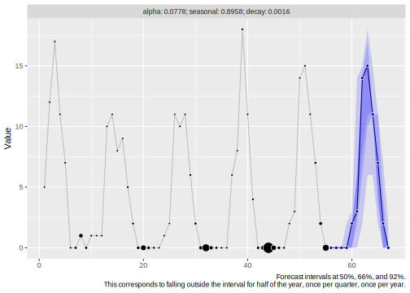
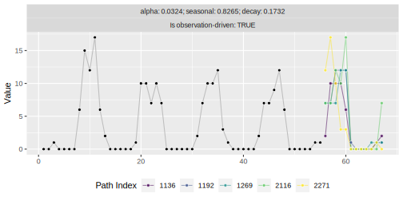
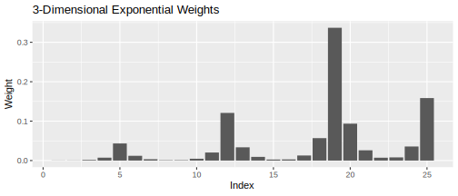
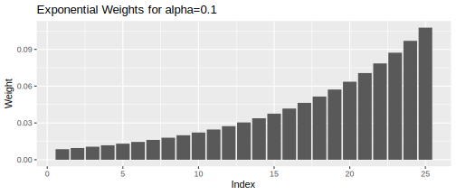
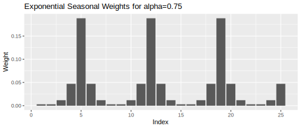
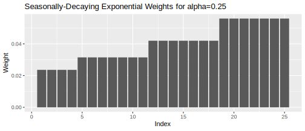
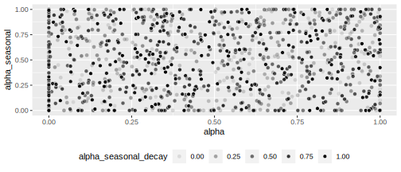

<!-- README.md is generated from README.Rmd. Please edit that file -->

# threedx (3DX)

<!-- badges: start -->

[](https://github.com/timradtke/threedx/actions/workflows/R-CMD-check.yaml)
[](https://app.codecov.io/gh/timradtke/threedx?branch=main)
<!-- badges: end -->

Use 3DX to generate interpretable probabilistic forecasts by purely
weighting values from the observed time series.

What’s unique about 3DX is that it can be used to derive forecasts not
only based on a “latent state” but also observation-driven, drawing
future realizations purely from observed values. This can be effective
for count or intermittent series.

3DX builds on ideas from the NPTS model described in [Alexandrov et
al. (2019)](https://arxiv.org/abs/1906.05264). Its sampling distribution
is a combination of three components: The first weighs observations
exponentially, the second weighs observations within each seasonal
period exponentially, the third weighs the seasonal periods over time
exponentially.

## Installation

You can install the development version of `threedx` from
[GitHub](https://github.com/timradtke/threedx) with:

``` r
# install.packages("devtools")
devtools::install_github("timradtke/threedx")
```

Written in pure R, with the `checkmate` package as the only direct
dependency, installing `threedx` is a breeze.

## Get Started

Let’s generate a sparse monthly time series that has a strong
seasonality.

``` r
y <- rpois(n = 55, lambda = pmax(0.1, 1 + 10 * sinpi(6:59 / 6)))
```

To forecast the series, we first fit a model by learning appropriate
weights given the period length of the series’ seasonality.

Afterwards, the model can be used to derive a forecast using R’s
`predict()` method.

``` r
library(threedx)

model <- threedx::learn_weights(
  y = y,
  period_length = 12L,
  alphas_grid = threedx::list_sampled_alphas(
    n_target = 1000L,
    include_edge_cases = TRUE
  ),
  loss_function = loss_mae
)

forecast <- predict(
  object = model,
  horizon = 12L,
  n_samples = 2500L,
  observation_driven = TRUE
)
```

When `ggplot2` is available, we can use `autoplot()` to visualize the
forecast object:

``` r
library(ggplot2)
autoplot(forecast)
```



The native output of a 3DX model are forecast sample paths, which can be
accessed via `forecast$paths`. Visualize (a few of) them instead of
quantile predictions by specifying the method `"paths"`:

``` r
autoplot(forecast, method = "paths", n = 5)
```



## How It Works

The basis for a 3DX model are different ways of assigning a categorical
probability distribution to the indices of the observed time series.

The distribution used in a 3DX model is based on a combination of three
components that come together in `weights_threedx()`. For a time series
of 25 daily observations, weights could look like this:

``` r
threedx::weights_threedx(
  alpha = 0.1,
  alpha_seasonal = 0.75,
  alpha_seasonal_decay = 0.25,
  n = 25L,
  period_length = 7L
)
#>  [1] 0.0003333007 0.0003703341 0.0016459293 0.0073152415 0.0433495791
#>  [6] 0.0120415498 0.0033448749 0.0009291319 0.0010323688 0.0045883058
#> [11] 0.0203924702 0.1208442681 0.0335678523 0.0093244034 0.0025901121
#> [16] 0.0028779023 0.0127906768 0.0568474525 0.3368737929 0.0935760536
#> [21] 0.0259933482 0.0072203745 0.0080226383 0.0356561704 0.1584718684
```



3DX weights are the product of three separate weight components.

### Exponential Weights

The simplest weight component is to assign exponentially decreasing
weights. For a time series of daily observations with 25 observations,
the weights could look like this:

``` r
threedx::weights_exponential(alpha = 0.1, n = 25)
#>  [1] 0.008593575 0.009548417 0.010609352 0.011788169 0.013097966 0.014553295
#>  [7] 0.016170328 0.017967031 0.019963368 0.022181520 0.024646133 0.027384593
#> [13] 0.030427325 0.033808139 0.037564599 0.041738443 0.046376048 0.051528942
#> [19] 0.057254380 0.063615978 0.070684420 0.078538245 0.087264716 0.096960796
#> [25] 0.107734218
```



Exponential weights are great as they smoothly interpolate between a
mean forecast for `alpha = 0` and a random walk or naive forecast for
`alpha = 1`.

But in many cases, we would like to model also a seasonal component of a
time series. 3DX approaches this with two additional weight components.

### Exponential Seasonal Weights

The first assigns exponential weights *within* a seasonal period. Again,
consider the time series of 25 daily observations. We suspect a weekly
seasonality and set `period_length = 7` when deriving seasonal weights:

``` r
threedx::weights_seasonal(alpha_seasonal = 0.75, n = 25, period_length = 7)
#>  [1] 0.002941176 0.002941176 0.011764706 0.047058824 0.188235294 0.047058824
#>  [7] 0.011764706 0.002941176 0.002941176 0.011764706 0.047058824 0.188235294
#> [13] 0.047058824 0.011764706 0.002941176 0.002941176 0.011764706 0.047058824
#> [19] 0.188235294 0.047058824 0.011764706 0.002941176 0.002941176 0.011764706
#> [25] 0.047058824
```

Starting from the point to be predicted next (index 26), the largest
weight is assigned to the index `period_length`-steps ago, index 19. The
same weight is assigned every other `period_length`-steps before that.
Within a period, weights decay symmetrically, with larger weights closer
to the season that is being predicted. Thus the index that is one step
before the index to be predicted will have the second highest weight.



### Seasonally-Decaying Exponential Weights

The final component assigns exponential weights *across* the seasonal
periods but constant weights within a period:

``` r
threedx::weights_seasonal_decay(
  alpha_seasonal_decay = 0.25,
  n = 25,
  period_length = 7
)
#>  [1] 0.02360140 0.02360140 0.02360140 0.02360140 0.03146853 0.03146853
#>  [7] 0.03146853 0.03146853 0.03146853 0.03146853 0.03146853 0.04195804
#> [13] 0.04195804 0.04195804 0.04195804 0.04195804 0.04195804 0.04195804
#> [19] 0.05594406 0.05594406 0.05594406 0.05594406 0.05594406 0.05594406
#> [25] 0.05594406
```

Starting from the point to be predicted next (index 26), the largest
weight is assigned to the index `period_length`-steps ago, index 19. The
same weight is assigned every other `period_length`-steps before that.
Within a period, weights decay symmetrically, with larger weights closer
to the season that is being predicted. Thus the index that is one step
before the index to be predicted will have the second highest weight.



### Learning the Optimal Weights

The weights generated by `weights_threedx()` are determined by three
parameters: `alpha`, `alpha_seasonal`, and `alpha_seasonal_decay`. These
three parameters define a 3DX model.

Each of the three parameters can take values between 0 and 1. Larger
values lead to faster decaying weights, assigning more weight to more
recent (seasonal) time indices. Smaller values lead to more uniform
weighting of time indices.

In `learn_weights()`, the optimal parameter combination is identified by
evaluating those defined in `alphas_grid` based on the provided
`loss_function`. Arbitrary loss functions of the observations `y` and
fitted values `y_hat` can be optimized as black-box function in one-shot
optimization. See, for example, `loss_rmse()` or
`loss_mae_with_observation_weight()`—then define your own!

The `alphas_grid` is a data frame in which each row represents a
parameter combination. Combinations to be evaluated can be drawn
uniformally using `list_sampled_alphas()`:

``` r
alphas_grid <- list_sampled_alphas(
  n_target = 1000L,
  alpha_lower = 0,
  alpha_upper = 1,
  alpha_seasonal_lower = 0,
  alpha_seasonal_upper = 1,
  alpha_seasonal_decay_lower = 0,
  alpha_seasonal_decay_upper = 1,
  include_edge_cases = TRUE
)

round(tail(alphas_grid), 4)
#>       alpha alpha_seasonal alpha_seasonal_decay
#> 995  0.3313         0.4698               1.0000
#> 996  0.7007         0.0188               0.3768
#> 997  0.8676         0.9452               0.5221
#> 998  0.8650         0.6694               0.0820
#> 999  0.6261         0.8915               0.5038
#> 1000 0.2067         0.3665               0.1281
```



Of course there is no need to use `list_sampled_alphas()` to generate
the set of parameter combinations to be evaluated. As only a data frame
of columns `alpha`, `alpha_seasonal`, `alpha_seasonal_decay` is
required, you can any set of parameters you see fit. This can be useful
to re-use previously determined parameters, or values close to them.

### 3DX Interpolates Between Edge Cases

Similarly to how simple exponential smoothing interpolates between the
mean forecast and the naive forecast, 3DX interpolates between 1) the
mean forecast, 2) the naive forecast, 3) the seasonal naive forecast, 4)
the seasonal mean forecast, and 5) the last period’s mean forecast.

The paramater combinations that encode those models can be listed using
`list_edge_alphas()`:

``` r
list_edge_alphas()
#>   alpha alpha_seasonal alpha_seasonal_decay
#> 1     0              0                    0
#> 2     1              0                    0
#> 3     0              1                    1
#> 4     0              1                    0
#> 5     0              0                    1
```

By choosing `include_edge_cases = TRUE` in `list_sampled_alphas()`, the
first five of the returned parameter combinations are those edge cases.
By including them, the edge cases are evaluated alongside all other
parameter combinations in `learn_weights()`.

## References

Alexander Alexandrov et al. (2019). *GluonTS: Probabilistic Time Series
Models in Python*. <https://arxiv.org/abs/1906.05264>

Jan Gasthaus (2016). *Non-parametric time series forecaster*. Technical
report, Amazon, 2016.

Suman Ravuri et al. (2021). *Skilful precipitation nowcasting using deep
generative models of radar*.
<https://www.nature.com/articles/s41586-021-03854-z>
