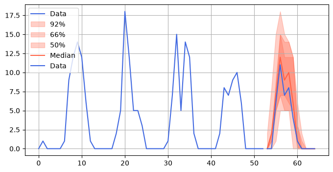

[](https://timradtke.github.io/threedx)

# threedx

Threedx provides an interface for interpretable probabilistic forecasts that puts you in control.

If you believe in choosing the right model for the job, you'll love that Threedx let's you pick the loss function at training time. And at prediction time, Threedx either forecasts by sampling from past observations, or via an innovations generating process you define.

Threedx could be the right fit for you, if...

- your users require interpretability,
- your use case benefits from a custom loss function,
- your data is dominated by seasonality while trends are weak,
- your data is intermittent, non-negative, or otherwise non-normal.

## Install threedx

Install Threedx from Github. Use either `pip`...

```bash
uv pip install "git+https://github.com/timradtke/threedx"
```

... or use [`uv`](https://docs.astral.sh/uv/):

```bash
uv pip install "git+https://github.com/timradtke/threedx"
```

From within a [python project managed with `uv`](https://docs.astral.sh/uv/guides/projects/), you can add `threedx` (showing
SSH as an alternative to HTTPS authentication):

```bash
uv add git+ssh://git@github.com/timradtke/threedx
```

The following syntax lets you install Threedx along with optional dependencies (e.g. `matplotlib` for graphics):

```bash
uv add "threedx[graphics] @ git+ssh://git@github.com/timradtke/threedx"
```

The same works when using pip.

## Getting Started

To do anything, you require a time series to predict. Import numpy to generate a fairly short time series of monthly, non-negative observations with a strong yearly seasonality.

```python
import numpy as np

n_obs = 65
period_length = 12
rng = np.random.default_rng(seed=512)

_y = rng.poisson(
    lam=np.maximum(
        0.1,
        1 + 10 * np.sin(2 * np.pi * np.arange(6, 6 + n_obs) / period_length)
    ),
    size=n_obs
)

y = _y[:(n_obs-period_length)]
y_future = _y[(n_obs-period_length):]
```

Now import Threedx and initialize the Threedx model with a parameter grid of your choosing. Then fit the model by minimizing a loss function you specify over the provided parameter grid.

```python
import threedx as tdx

model = tdx.Threedx(
    period_length=12,
    parameter_grid=tdx.initialize_parameters_at_random(
        size=2500,
        seed=729,
        include_edge_cases=True
    )
)

model = model.fit(
    y=y,
    loss=tdx.mae # Specify your preferred loss function
)
```

Draw sample path forecasts for the next period from the fitted model using Threedx's observation-driven approach.

```python
sample_paths_from_observations = model.predict(
    horizon=period_length,
    n_samples=2501,
    observation_driven=True,
    draw=None,
    seed=388
)
```

If you've installed the optional `threedx[graphics]` dependencies, you can plot the sample paths as marginal quantiles.

```python
from threedx.graphics import plot_forecast

plot_forecast(
    forecast=sample_paths_from_observations,
    y=y,
    y_future=y_future
)
```


